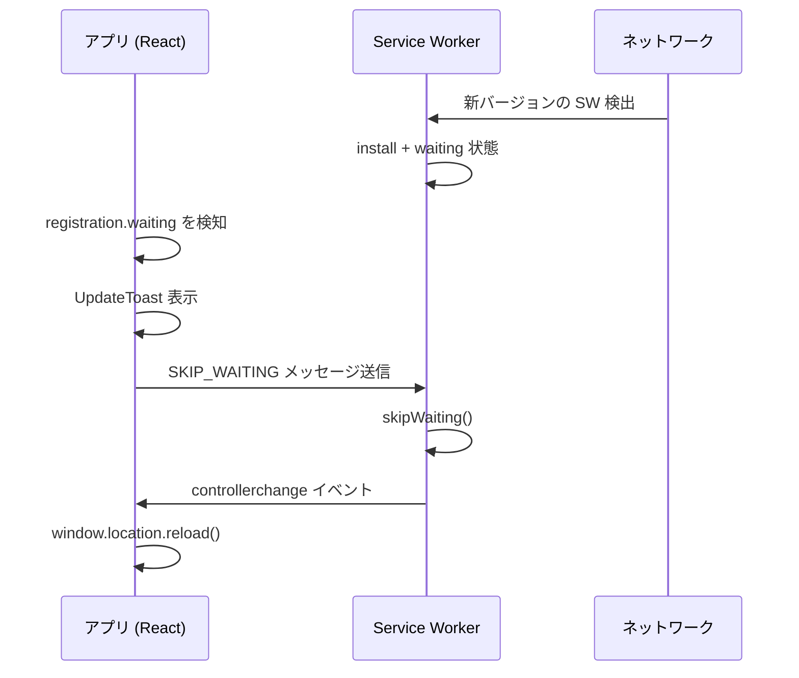

# v2 技術方針

> 関連: [機能仕様.md](./機能仕様.md) / [UI・デザイン仕様.md](./UI・デザイン仕様.md)

---

## 1. 方針サマリー

| 観点 | v1 | v2（方針） |
|------|-----|-----------|
| 構成 | 素の HTML/CSS/JS | **Vite + React + TypeScript** で SPA 化 |
| 配信 | 静的ファイル直置き | ビルド成果物を GitHub Pages にデプロイ |
| 状態管理 | グローバル変数 + localStorage | フレームワーク + 永続化レイヤー |
| PWA | 手動キャッシュ更新 | **自動更新フロー** を実装 |
| テスト | なし | コアロジックにユニットテスト（推奨） |

---

## 2. フレームワーク選定

### 2.1 要件

- コンポーネントベースで画面が増える v2 に適合
- PWA（vite-plugin-pwa）との親和性
- GitHub Pages への静的デプロイ
- TypeScript 対応（型安全にクイズロジックを書きたい）
- 学習コストとエコシステムのバランス

### 2.2 候補比較

| 候補 | メリット | デメリット |
|------|---------|-----------|
| **React + Vite** | 情報量が多い、PWA プラグイン成熟、採用例多数 | ボイラープレートやや多め |
| Vue 3 + Vite | テンプレートが直感的、学習しやすい | 本プロジェクトでの既存資産なし |
| SvelteKit | 軽量・高速 | GH Pages デプロイ設定やや複雑、静的化の理解が必要 |

### 2.3 確定スタック

**Vite + React + TypeScript**（D-01 確定）

| レイヤー | 選定 |
|----------|------|
| ビルド | Vite |
| UI | React 18+ |
| 言語 | TypeScript |
| ルーティング | React Router |
| PWA | vite-plugin-pwa |
| テスト | Vitest |

### 2.4 スタイリング（確定）

**CSS Modules + CSS Variables**（D-07 確定）

- グローバルなデザイントークン（色・余白・フォント）は `src/styles/tokens.css` に CSS Variables で定義
- コンポーネント固有スタイルは `*.module.css` に記述
- Tailwind 等のユーティリティ CSS フレームワークは v2 では採用しない

---

## 3. ディレクトリ構成（案）

```
kimariji_master/
├── doc/                      # ドキュメント
├── public/                   # 静的アセット（ビルド時そのままコピー）
│   ├── torifuda/
│   ├── goro_slide/
│   ├── goro_thumbnail/
│   ├── icon.png
│   └── ...
├── src/
│   ├── main.tsx
│   ├── App.tsx
│   ├── components/           # 共通 UI
│   ├── features/             # 機能単位
│   │   ├── beginner/
│   │   ├── one-minute/
│   │   ├── quiz/             # 4択共有
│   │   ├── legacy-check/
│   │   └── legacy-study/
│   ├── hooks/
│   ├── lib/                  # 純粋関数（クイズ生成・シャッフル等）
│   ├── data/
│   │   └── fudalist.ts       # fudalist.js を TS 化
│   ├── stores/               # 永続化・グローバル状態
│   └── styles/
├── index.html
├── vite.config.ts
├── package.json
└── tsconfig.json
```

### v1 ファイルの扱い

| v1 ファイル | v2 での扱い |
|------------|------------|
| `fudalist.js` | `src/data/fudalist.ts` に移行 |
| `script.js` | 機能ごとに分割・移植後 **廃止** |
| `style.css` | デザイントークン・コンポーネント CSS に再構成 |
| `sw.js` | `vite-plugin-pwa` が生成（手書き SW は廃止） |
| `index.html` | Vite エントリに |

---

## 4. ルーティング

クライアントサイドルーティング（React Router 等）を導入。

| パス | 画面 |
|------|------|
| `/` | ホーム |
| `/beginner` | 初心者モード（学習） |
| `/beginner/quiz` | 初心者モード・テスト |
| `/beginner/result` | 初心者モード・結果 |
| `/one-minute` | 1 分間確認 |
| `/one-minute/result` | 1 分間結果 |
| `/check` | 決まり字チェック（v1 継承） |
| `/study` | 学習一覧 |
| `/study/:id` | 学習詳細 |

GitHub Pages 向けに `404.html` フォールバック or `base` 設定を行う。

---

## 5. 状態管理・永続化

### 5.1 方針

- **サーバーなし**。引き続き `localStorage` のみ
- 永続化ロジックは `stores/` に集約し、UI から分離
- v1 キーからの **マイグレーション関数** を初回起動時に実行

### 5.2 マイグレーション

```typescript
// 疑似コード
function migrateStorage() {
  // v1: fudanagashi:letters → そのまま「覚えたフラグ」として利用
  // 将来: kimariji:v2:learned 等にリネームする場合はここで変換
}
```

### 5.3 ランタイム状態（非永続）

| 状態 | 保持場所 |
|------|---------|
| 初心者バッチの 5 首 | セッション state（React state / context） |
| クイズ進行中 | コンポーネント state |
| 1 分タイマー | `useRef` + `requestAnimationFrame` or `setInterval` |

---

## 6. クイズロジック（純粋関数として分離）

`src/lib/quiz.ts` に集約し、ユニットテスト可能にする。

```typescript
// インターフェース案
type Fuda = { no: number; kimariji: string; normal: string; /* ... */ };

function pickRandomBatch(pool: Fuda[], count: number): Fuda[];

function buildQuestion(
  correct: Fuda,
  distractorPool: Fuda[],
  distractorCount: 3
): { correct: Fuda; choices: Fuda[] }; // choices はシャッフル済み

function gradeAnswer(choices: Fuda[], selectedNo: number, correctNo: number): boolean;
```

---

## 7. PWA 構成

### 7.1 使用プラグイン

**vite-plugin-pwa**（Workbox ベース）

- `manifest.json` 生成
- Service Worker 自動生成
- プリキャッシュ対象の glob 設定

### 7.2 プリキャッシュ対象

v1 と同等以上をカバー:

- アプリシェル（JS/CSS/HTML）
- `fudalist` データ（JS バンドル内）
- `torifuda/**`（201 枚）、`goro_slide/**`（100 枚）、`goro_thumbnail/**`（100 枚）
- アイコン

ビルド時の Workbox プリキャッシュは **413 エントリ・約 9.3MB**（2026-06 時点）。PWA インストール後は **オフラインでも全札画像・語呂スライドが利用可能**。

### 7.3 PWA 自動更新フロー（詳細）

#### 課題の原因（v1）

- 新 SW は install されるが、旧 SW が `clients` を握ったまま
- ユーザーがタブを閉じない限り `skipWaiting` だけでは即時切替しない場合がある
- 更新後もユーザーが手動でキャッシュクリアしていた

#### v2 の解決策



#### 実装ポイント

| 項目 | 実装 |
|------|------|
| SW 側 | `self.skipWaiting()` を `message` イベントで呼ぶ |
| SW 側 | `clientsClaim()` を activate で実行 |
| App 側 | `navigator.serviceWorker.register()` + `updatefound` 監視 |
| App 側 | `registration.waiting` があれば更新 UI 表示 |
| App 側 | ユーザーが「更新」タップ → `postMessage({ type: 'SKIP_WAITING' })` |
| App 側 | `navigator.serviceWorker.addEventListener('controllerchange', () => reload)` |
| 頻度 | `registration.update()` をフォーカス時・定期（例: 1 時間ごと）に実行 |

#### ユーザー体験（D-06 確定）

**トースト + ユーザーが「更新」タップ → リロード**

- クイズ・1 分モード **プレイ中は更新トーストを遅延**（プレイ終了 or ホーム遷移後に表示）
- ホーム・学習画面など非プレイ中は通常どおりトースト表示

#### キャッシュバスティング

- `vite-plugin-pwa` の `injectManifest` or `generateSW` でファイルハッシュ付きバンドル
- `fudalist` や画像更新時もビルドでハッシュが変わり自動的に再取得

---

## 8. PWA インストール案内の実装

| 環境 | API / 手法 |
|------|-----------|
| Chromium | `beforeinstallprompt` を intercept → カスタム UI から `prompt()` |
| iOS | 手順モーダルのみ（プログラムインストール不可） |
| スタンドアロン | `display-mode: standalone` メディアクエリで案内スキップ |

```typescript
// スタンドアロン判定
const isStandalone =
  window.matchMedia('(display-mode: standalone)').matches ||
  (navigator as Navigator & { standalone?: boolean }).standalone === true;
```

---

## 9. 効果音の実装

```typescript
// Web Audio API or HTMLAudioElement
// 初回タップで unlock
class SoundManager {
  unlock(): void;
  playCorrect(): void;
  playIncorrect(): void;
  setEnabled(enabled: boolean): void;
}
```

- ファイル: `public/assets/sounds/correct.mp3`, `incorrect.mp3`
- 素材: **フリー素材サイト**から取得（D-08 確定）
- ライセンス: `doc/クレジット.md` または README に出典・利用条件を記載
- SW プリキャッシュに含める

---

## 10. ビルド・デプロイ

### 10.1 開発

```bash
npm install
npm run dev      # localhost:5173
```

### 10.2 本番ビルド

```bash
npm run build    # dist/ 出力
```

### 10.3 GitHub Pages（D-10 確定）

| 項目 | 設定 |
|------|------|
| `base` | `'/kimariji_master/'`（リポジトリ名に合わせる） |
| デプロイ | **GitHub Actions** で `dist/` を自動デプロイ |
| 公開 URL | `https://kg9n3n8y.github.io/kimariji_master/` を維持 |

### 10.4 CI/CD（確定）

`main` / `v2` への push または tag 時に GitHub Actions でビルド・デプロイ。

```yaml
# .github/workflows/deploy.yml（実装時に作成）
name: Deploy to GitHub Pages
on:
  push:
    branches: [main]   # v2 マージ後
jobs:
  build-and-deploy:
    runs-on: ubuntu-latest
    steps:
      - uses: actions/checkout@v4
      - uses: actions/setup-node@v4
        with:
          node-version: '20'
          cache: 'npm'
      - run: npm ci
      - run: npm run test
      - run: npm run build
      - uses: actions/upload-pages-artifact@v3
        with:
          path: dist/
      - uses: actions/deploy-pages@v4
```

> 初回はリポジトリ Settings → Pages で **GitHub Actions** をソースに設定する。

---

## 11. テスト方針（推奨）

| 対象 | ツール | 例 |
|------|--------|-----|
| クイズ生成・採点 | Vitest | `buildQuestion` のダミー重複なし |
| バッチ抽選 | Vitest | 未覚え 3 首のとき 3 首ピック |
| ストアマイグレーション | Vitest | v1 localStorage → v2 |
| E2E（任意） | Playwright | 初心者モード一連フロー |

---

## 12. パフォーマンス

| 施策 | 内容 |
|------|------|
| 画像 | 現行 PNG を継続。将来 WebP 検討 |
| コード分割 | ルートベースの lazy import |
| プリロード | v1 同様、アイドル時に取り札をチャンク読み込み |
| バンドルサイズ | React 導入で増える分はコード分割で緩和 |

---

## 13. セキュリティ・プライバシー

- 個人情報の収集なし
- 外部 API 呼び出しなし（v2 もオフライン完結）
- 作者リンク等の外部 URL のみ

---

## 改訂履歴

| 日付 | 内容 |
|------|------|
| 2026-06-11 | 初版 |
| 2026-06-11 | D-01, D-06, D-07, D-08, D-10 を確定反映 |
| 2026-06-11 | PWA プリキャッシュ件数を実測値で追記 |
