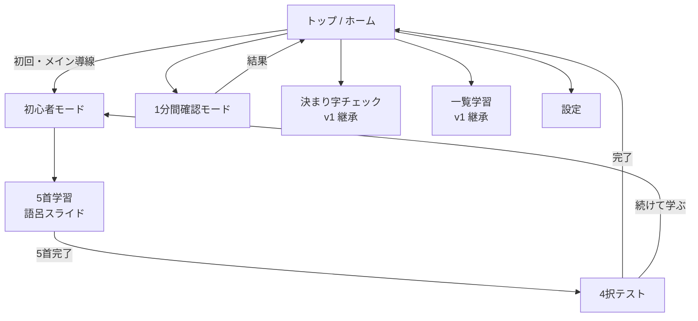

# v2 概要

> ステータス: 設計中（実装前）  
> 対象ブランチ: `v2`  
> 最終更新: 2026-06-11

---

## 1. v2 で目指すこと

v1 は「100 首を自由に選んで練習できる」上級者・自主学習者向けのツールだった。  
v2 では **初心者が最初の一歩から迷わず進める導線** を最優先し、以下を実現する。

1. **覚えていない札から少しずつ学ぶ**（5 首単位のバッチ学習）
2. **4 択クイズで即フィードバック**（○× 表示・効果音）
3. **1 分間チャレンジで定着を測る**（覚えた札のみ・スコア競争）
4. **ネイティブアプリっぽい UI**（和風テイスト維持・マルチデバイス対応）
5. **PWA の初回案内と自動更新**（インストール促進・手動再インストール不要）

---

## 2. ターゲットユーザー

| ペルソナ | v2 での体験 |
|----------|------------|
| **初心者（メイン）** | 起動 → 初心者モード → 5 首学習 → テスト → 繰り返し |
| **ある程度覚えた人** | 1 分間確認モードでスコア更新・定着確認 |
| **v1 からの既存ユーザー** | 従来の決まり字チェック・一覧学習も継続利用可能（後述） |

---

## 3. スコープ

### 3.1 v2 でやること

| カテゴリ | 内容 |
|----------|------|
| 新機能 | 初心者モード（5 首バッチ学習 + 4 択テスト） |
| 新機能 | 1 分間確認モード（4 択・60 秒スコア） |
| UI 改修 | 和風 × ネイティブアプリ風デザイン、レスポンシブ対応 |
| 技術刷新 | JS フレームワーク導入（ビルドツール併用） |
| PWA 改善 | 初回インストール案内、自動アップデート |

### 3.2 v2 のスコープ外（当面）

- ユーザーアカウント・クラウド同期
- ランキング・ソーシャル機能
- 読み上げ音声（読み手ボイス）の再生
- 逆方向クイズ（取り札から決まり字を選ぶ）※将来候補

---

## 4. コアコンセプトの変化

### 4.1 「覚えたフラグ」の中心地位

v1 では「チェックで使う札（設定オン）」が補助的な設定だった（初期状態は全オフ）。  
v2 では **「覚えた」フラグ** をアプリの中心状態として扱う。

| 状態 | 意味（v2） |
|------|-----------|
| 覚えた（フラグオン） | 1 分間確認の出題候補。決まり字チェック（v1）の出題対象 |
| 未覚え（フラグオフ） | 初心者モードの学習候補 |

**初心者モードでのフラグ更新**: 学習フェーズでは変更せず、**テストで正解した札のみオン**にする（D-02 確定）。

v1 の `fudanagashi:letters`（札ごとの boolean）を **そのまま「覚えたフラグ」として継承** する想定（キー名は移行時にリネーム検討可）。

### 4.2 4 択クイズの共通化

初心者モードの「テスト」と 1 分間確認モードは、**同一のクイズ UI コンポーネント** を共有する。

```
┌─────────────────────────┐
│      あきの              │  ← 決まり字テキスト
├─────────────────────────┤
│  [札A]  [札B]           │
│  [札C]  [札D]           │  ← 4 枚の取り札（2×2 グリッド想定）
└─────────────────────────┘
```

---

## 5. 画面構成（v2 全体像・案）



### トップ画面の優先順位（案）

1. **初心者モード**（最も目立つ・初回ユーザー向け）
2. **1 分間確認モード**
3. 決まり字チェック（v1 継承・サブ導線）
4. 決まり字を覚える（v1 継承・一覧学習）
5. 札の設定

---

## 6. 成功指標（定性）

実装後に以下ができていれば v2 成功とみなす。

- [ ] 初めて開いたユーザーが、説明なしで「5 首学習 → テスト」まで到達できる
- [ ] 覚えたフラグ 5 首以上で 1 分間確認を開始できる
- [ ] スマホ・タブレット・PC で主要画面が崩れない
- [ ] PWA 更新後、ユーザーが手動で再インストールしなくても最新版が使える
- [ ] 初回のみ PWA インストール案内が表示される

---

## 7. 関連ドキュメント

- [機能仕様.md](./機能仕様.md)
- [UI・デザイン仕様.md](./UI・デザイン仕様.md)
- [技術方針.md](./技術方針.md)
- [v1からの変更点.md](./v1からの変更点.md)
- [未決定事項.md](./未決定事項.md)
