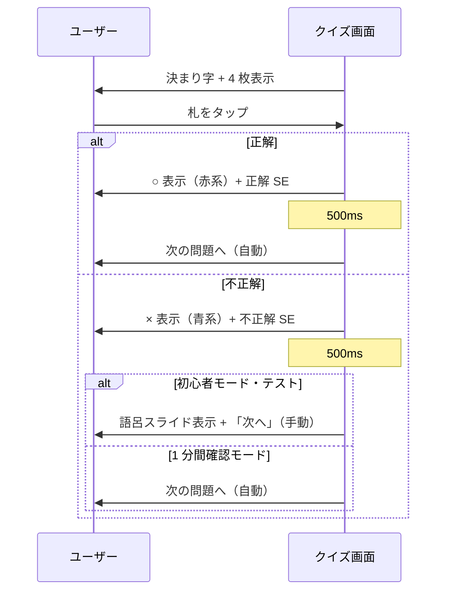
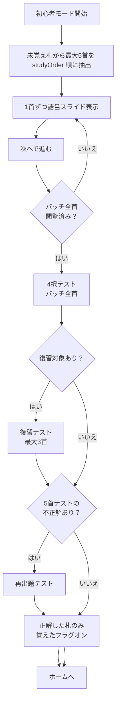

# v2 機能仕様

> 関連: [概要.md](./概要.md) / [UI・デザイン仕様.md](./UI・デザイン仕様.md)

---

## 1. 共通：覚えたフラグ

### 1.1 定義

| 項目 | 仕様 |
|------|------|
| 名称（UI） | 「覚えた」「覚えたフラグオン」等（文言は UI 設計で確定） |
| 単位 | 歌（札）ごと。100 首それぞれに独立 |
| 永続化 | `localStorage`（v1 の `fudanagashi:letters` を継承 or 移行） |
| デフォルト | **全札オフ（未覚え）** |

### 1.2 フラグの操作箇所

| 操作場所 | 動作 |
|----------|------|
| **初心者モード・テスト（正解時）** | **正解した札のみ自動でオン**（学習フェーズではフラグを変更しない） |
| 学習詳細画面（v1 継承） | タップでトグル（v1 と同様） |
| 設定モーダル（v1 継承） | 個別 / グループ / すべてオンオフ |
| 学習一覧カード | オン状態を色で表示（v1 継承） |

#### 初心者モードにおけるフラグのルール（確定）

- 学習フェーズ（語呂スライド閲覧）ではフラグは **変更しない**
- テストで **正解** → 当該札のフラグを **オン**
- テストで **不正解** → フラグは **オフのまま**（変更しない）
- テスト開始前に既にオンだった札がバッチに含まれることは通常ない（抽選元は未覚えのみ）

### 1.3 利用箇所

| 機能 | 未覚え（オフ） | 覚えた（オン） |
|------|---------------|---------------|
| 初心者モードの学習ピックアップ | ○ 候補 | × 対象外 |
| 初心者モードのテスト | 当該バッチ内のみ | — |
| 1 分間確認モード | × 出題しない | ○ 出題候補 |
| 決まり字チェック（v1） | × | ○ 出題候補 |

---

## 2. 共通：4 択クイズ

初心者モードのテストと 1 分間確認モードで共有するクイズ形式。

### 2.1 画面要素

| 要素 | 内容 |
|------|------|
| 決まり字表示 | 出題札の `kimariji` を大きく表示 |
| 選択肢 | 取り札画像 4 枚（通常向き `normal` を基本使用） |
| レイアウト | 2×2 グリッド（レスポンシブで 1 列 4 行にも対応可） |
| タイマー表示 | 1 分間確認モードのみ画面上部に残り秒数 |
| スコア表示 | 1 分間確認モードのみ画面上部に **得点** を表示 |

### 2.2 出題ロジック

#### 正解

- 出題対象の 1 札の `normal` 画像（逆向きは v2 クイズでは **使用しない** — 難易度調整のため）

#### 誤答（ダミー 3 枚）

| モード | ダミーの抽選元 |
|--------|---------------|
| 初心者モード・テスト | **優先**: 当該バッチ内の正解以外。**不足時**: **未覚え全体**（バッチ外含む）から補充 |
| 1 分間確認モード | **覚えたフラグオンの札全体**から正解以外をランダム 3 枚 |

##### 初心者モードのダミー補充アルゴリズム（確定）

1. バッチ内の他の札から最大 3 枚を抽選
2. 3 枚に満たない場合（バッチが 4 首以下など）、**未覚えフラグオンの札全体**（当該バッチ外を含む）から不足分を補充
3. それでも 3 枚に満たない場合（未覚えが極端に少ない）、**覚えた札も含む全札**から補充（エッジケース。100 首中ほぼ覚え済みのときのみ発生）

#### 選択肢の並び

- 4 枚の位置は **毎問ランダムシャッフル**
- 同一問題内で画像の重複なし

#### 出題札の選び方

| モード | 選び方 |
|--------|--------|
| 初心者モード・テスト | バッチ 5 首を **ランダム順** に 1 問ずつ（各札 1 回） |
| 1 分間確認モード | 覚えた札から **ランダムに繰り返し**（同一札の再出題あり） |

### 2.3 回答フロー



### 2.4 フィードバック仕様

| 種別 | 視覚 | 聴覚 |
|------|------|------|
| 正解 | ○ マーク（**赤系**グラデーション）を画面中央に表示 | 正解効果音（短い） |
| 不正解 | × マーク（**青系**グラデーション）を画面中央に表示 | 不正解効果音（短い） |

#### 追加フィードバック（確定）

- **フィードバック表示時間**: 正解・不正解とも **500ms**
- **初心者モード・テストで不正解時**: 取り札は非表示。語呂合わせスライドを表示し、ユーザーが「次へ」を押すまで待つ（正解札のハイライトは行わない）
- **1 分間確認モードで不正解時**: 500ms 後に自動で次問へ
- **回答中**: 他の選択肢を `disabled` にして連打防止

### 2.5 効果音

| 項目 | 仕様 |
|------|------|
| 形式 | **Web Audio API**（オシレーターによる短いビープ音）。外部 SE ファイルは使用しない |
| 音量 | 端末のメディア音量に従う |
| ミュート | **設定 UI なし**（v2.1 時点） |
| 初回 | ブラウザの自動再生ポリシー対策として、**最初のユーザー操作後** に AudioContext を有効化 |

### 2.6 最低札数要件

| モード | 最低必要数 | 理由 |
|--------|-----------|------|
| 4 択（一般） | **4 首以上** | 正解 1 + ダミー 3 が必要 |
| 初心者モード・テスト | **バッチ内 5 首**（学習フロー上） | 仕様どおり 5 首学習 |
| 1 分間確認モード | **覚えたフラグ 100 首（全コンプリート）** | コンプリート後の総復習用 |

---

## 3. 初心者モード

### 3.1 目的

アプリを初めて開いたユーザーが、**迷わず少しずつ決まり字を覚え、すぐに確認テストに入れる** 導線。

### 3.2 開始条件

| 条件 | 仕様 |
|------|------|
| 未覚えの札 | 1 首以上あれば開始可能 |
| 未覚え 0 首 | 「すべて覚えました」等のメッセージ + 1 分間確認への誘導 |

### 3.3 フロー全体



全 100 首覚え済みのときは **おてがる復習**（5 首の復習テストのみ。学習フェーズなし）。

### 3.4 ステップ 1：5 首のピックアップ

| 項目 | 仕様 |
|------|------|
| 抽選元 | 覚えたフラグが **オフ** の札 |
| 抽選数 | `min(5, 未覚え札数)` |
| 抽選方法 | 未覚え札を **`studyOrder` 昇順** で先頭から取得（ランダムではない） |
| 未覚えが 5 未満 | 残り全部をバッチとする（例: 3 首だけ学習 → 3 問テスト） |

バッチ内容はセッション中固定（学習中に別画面でフラグが変わっても当該バッチは維持）。

### 3.5 ステップ 2：語呂合わせ学習

v1 の学習詳細画面に近い情報を、**バッチ内の 5 首に絞って順送り** する。

#### 1 首あたりの表示

| 要素 | データソース |
|------|-------------|
| 語呂合わせスライド | `goro_slide/{goroImage}` |
| 決まり字 | `kimariji` |
| 上の句 / 下の句 | `upper` / `lower` |
| 歌番号 / 作者 | `no` / `author` |
| 進捗 | 「**学習** X / 5」形式（右上バッジ） |
| レイアウト | クイズの不正解レビューと同様、**max-width 420px** の単一カラム |

#### 操作

| 操作 | 動作 |
|------|------|
| 「次へ」ボタン | 次の首へ進む（**フラグは変更しない**） |
| `←` / `→` | バッチ内の前後移動 |
| スキップ | v2 初版では **なし**（シンプル優先） |

> 学習フェーズに「覚えた！」ボタンは **設けない**。覚えたかどうかはテストの正誤で判定する。

#### 学習完了の定義（テストへ進む条件）

- バッチ内の **全首を 1 回ずつ画面で確認した** こと（「次へ」で最後まで到達）

### 3.6 ステップ 3：4 択テスト（バッチ内）

| 項目 | 仕様 |
|------|------|
| 出題数 | **バッチ内の全首**（最大 5。未覚えが 5 未満のときはその数） |
| 出題形式 | [§2 4択クイズ](#2-共通4-択クイズ) |
| 進捗表示 | 右上バッジ「5 / 5」等（緑系） |
| ダミー | バッチ内優先、不足時は未覚え全体から補充（[§2.2](#22-出題ロジック)） |
| 制限時間 | **なし**（1 問ずつじっくり） |
| 不正解時 | 語呂スライド + 手動「次へ」（[§2.4](#24-フィードバック仕様)） |
| フラグ更新 | **正解した札のみ** 覚えたフラグをオンにする |

#### テスト後のフラグ更新タイミング

| タイミング | 動作 |
|-----------|------|
| 各問正解時 | 即座にフラグオン + localStorage 保存 |
| 各問不正解時 | フラグは触らない |

### 3.6.1 復習テスト（5 首テスト後）

| 項目 | 仕様 |
|------|------|
| 対象 | 覚えた札のうち、最後の学習から **6 時間以上** 経過した札 |
| 出題数 | 最大 **3 首**（古い順） |
| 進捗表示 | 「**復習** X / N」（青系バッジ） |
| フラグ | 正解・不正解ともフラグは変更しない |

### 3.6.2 再出題テスト（復習後）

| 項目 | 仕様 |
|------|------|
| 対象 | 5 首テストで **不正解だった札のみ** |
| 進捗表示 | 「**再出題** X / N」（橙系バッジ） |
| フラグ | **正解した札のみ** 覚えたフラグをオン |

### 3.7 ステップ 4：テスト完了 → ホームへ

テスト（再出題まで含む）終了後、最後の問題の処理が終わってから **トップ画面（ホーム）へ遷移** する（専用の結果画面なし）。

| ホームでの表示 | 内容 |
|---------------|------|
| 覚えた増分 | 進捗メーター横に **+N 首**（今回新たにフラグがオンになった数） |
| 進捗メーター | テスト前の枚数から現在の枚数へ **アニメーション** で増加 |

次の 5 首を学ぶ場合は、ホームから再度「初心者モード」を選ぶ。

---

## 4. 1 分間確認モード

### 4.1 目的

覚えた札について、**時間制限付き 4 択** でどれだけ素早く正解できるかを測る。定着確認・繰り返し練習用。

### 4.2 開始条件

| 条件 | 満たさない場合 |
|------|---------------|
| 覚えたフラグオンが **100 首（全コンプリート）** | ホームでカードを **グレーアウト** + 「あと N 首で解放」表示 |

ホームのカードから `/one-minute` へ **直接** 遷移する（入口説明画面なし）。

### 4.3 ゲームルール

| 項目 | 仕様 |
|------|------|
| 制限時間 | **60 秒**（カウントダウン。開始前に 3 秒カウント） |
| 出題 | 覚えた札からランダムに繰り返し出題 |
| 形式 | [§2 4択クイズ](#2-共通4-択クイズ) |
| スコア | **得点制**。正解 1 問あたり **10 点** + 連続正解ボーナス（2 連続で +1、3 連続で +2 …） |
| 不正解時 | 500ms フィードバック後、自動で次問（語呂スライドなし） |
| 時間切れ | 回答中の問題は無効化し結果画面へ |
| 途中退出 | 確認ダイアログ後にトップへ。**スコアは記録しない** |

### 4.4 画面表示（プレイ中）

```
┌─────────────────────────────┐
│  ← トップ        残り 42秒   │
├─────────────────────────────┤
│         はるす               │
├─────────────────────────────┤
│   [img]    [img]            │
│   [img]    [img]            │
├─────────────────────────────┤
│         120 点              │
└─────────────────────────────┘
```

### 4.5 結果画面

| 表示 | 内容 |
|------|------|
| スコア | `60秒で 120 点！` |
| ベスト記録 | 過去最高得点との比較（`kimariji:oneMinuteBest`） |
| リトライ | 「もう一度」ボタン |
| トップへ | ホームに戻る |

---

## 5. PWA 初回インストール案内

### 5.1 目的

ホーム画面追加のメリット（オフライン・全画面）を初回ユーザーに伝え、インストール率を上げる。

### 5.2 表示条件

| 条件 | 仕様 |
|------|------|
| 回数 | **初回のみ**（1 度閉じたら再表示しない） |
| スタンドアロン起動中 | 表示しない（すでにインストール済み） |

### 5.3 表示内容（プラットフォーム別）

| 環境 | 案内内容 |
|------|----------|
| iOS Safari | 「共有」→「ホーム画面に追加」 |
| Android Chrome | `beforeinstallprompt` 対応時はネイティブプロンプト or カスタム UI |
| デスクトップ Chrome / Edge | アドレスバーのインストールアイコン |
| その他 | 汎用テキスト + ブラウザ名の一般的手順 |

### 5.4 UI 形式

- ボトムシート or モーダル
- 「後で」「閉じる」ボタン
- 閉じたとき `localStorage` に `pwaInstallPromptSeen: true` を保存

---

## 6. PWA 自動更新

### 6.1 現状の課題（v1）

- `CACHE_VERSION` 更新後、インストール済み PWA が古いキャッシュを使い続ける
- ユーザーがキャッシュ削除・再インストールする必要がある

### 6.2 v2 の目標

**開発側がデプロイしたら、ユーザーの PWA も自動（または 1 タップ）で最新版に更新される。**

### 6.3 仕様概要

詳細は [技術方針.md](./技術方針.md) を参照。ユーザー体験としては以下。

| 段階 | ユーザーへの見え方 |
|------|-------------------|
| 更新検知 | バックグラウンドで新 SW がダウンロード |
| 適用タイミング | **トースト通知 → ユーザーが「更新」タップ → リロード**（クイズ・1 分モードプレイ中は遅延） |
| 適用後 | ページリロードで最新 UI |

---

## 7. v1 継承機能の位置づけ

v2 でも以下は **残す**（仕様は [v1からの変更点.md](./v1からの変更点.md) 参照）。

| 機能 | v2 での扱い |
|------|------------|
| 決まり字チェック（連続表示・タイマー） | サブモードとして維持。ホームから `/check` へ直接プレイ |
| 一覧学習（分類別カード） | サブモードとして維持 |
| 札の設定（グループ / 個別） | 維持。「覚えたフラグ」と同一状態 |
| 逆向き札（チェックモード） | チェックモードのみ継続 |
| タイム履歴（チェック 3 回） | 維持 |

---

## 8. データ・永続化まとめ

| キー（案） | 内容 | 新規/継承 |
|-----------|------|----------|
| `fudanagashi:letters` | 覚えたフラグ（札番号 → boolean） | 継承 |
| `fudanagashi:reverseEnabled` | 逆向き札（チェックモード用） | 継承 |
| `fudanagashi:history` | 決まり字チェック履歴 | 継承 |
| `kimariji:oneMinuteBest` | 1 分間ベスト得点 | 新規 |
| `kimariji:oneMinuteHistory` | 1 分間プレイ履歴（内部保存・UI 非表示） | 新規 |
| `kimariji:pwaInstallPromptSeen` | インストール案内済み | 新規 |

---

## 改訂履歴

| 日付 | 内容 |
|------|------|
| 2026-06-11 | 初版（ユーザー要件をもとに策定） |
| 2026-06-11 | D-01〜D-10 の決定を反映（テスト正解時フラグオン、ダミー補充等） |
| 2026-06-11 | v2.1 実装に合わせて更新（studyOrder 順、得点制、復習/再出題、語呂レビュー等） |
