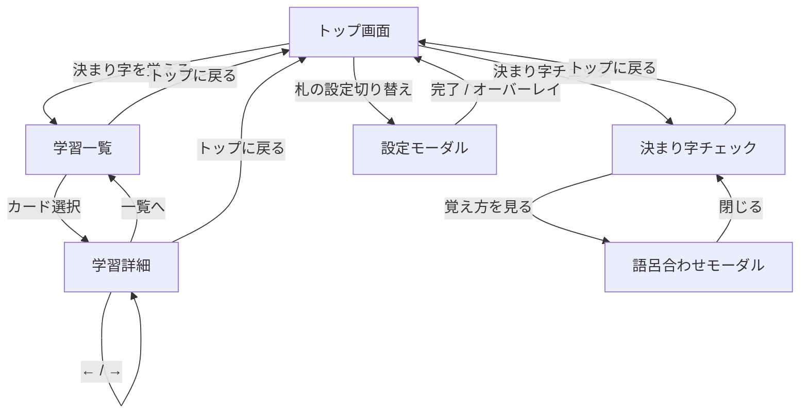
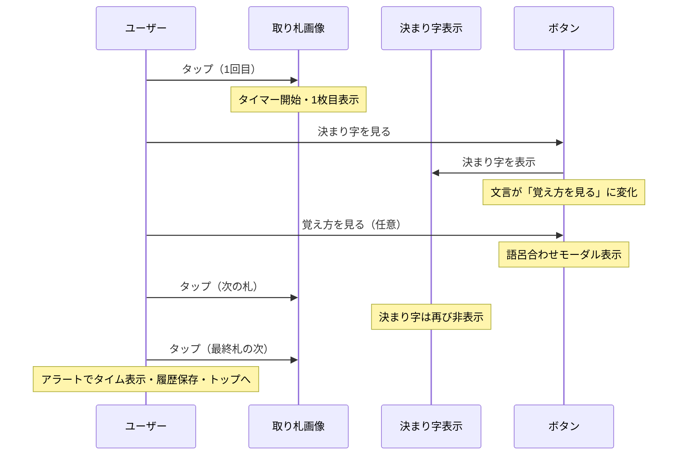

# 決まり字マスター 現状仕様書（v1）

> 対象ブランチ: `main`（v2 開発前の現行版）  
> 最終確認日: 2026-06-11  
> 公開 URL: https://kg9n3n8y.github.io/kimariji_master/

> **v2 開発中** — 新仕様は [v2 ドキュメント](./v2/README.md) を参照。

---

## 1. プロダクト概要

### 1.1 目的

小倉百人一首の**決まり字**を、語呂合わせ画像付きで学習・暗記し、取り札画像から決まり字を思い出せるかをブラウザ上で練習するための Web アプリ（PWA）。

### 1.2 主要な価値

- 100 枚すべての取り札画像・語呂合わせスライドを同梱し、**オフラインでも練習可能**
- 出題する札を細かく選べる（決まり字の 1 文字目グループ単位 / 個別）
- **決まり字チェック**（タイム計測付き）と**語呂合わせ学習**の 2 系統のモード
- インストール不要。ホーム画面追加でスタンドアロン起動

### 1.3 技術スタック

| 項目 | 内容 |
|------|------|
| 構成 | 静的ファイルのみ（ビルドツールなし） |
| 言語 | HTML / CSS / 素の JavaScript |
| データ | `fudalist.js` に 100 首分を直書き |
| 永続化 | `localStorage` |
| オフライン | Service Worker（`sw.js`）+ Web App Manifest |
| 配信 | GitHub Pages 想定 |

### 1.4 ファイル構成

```
kimariji_master/
├── index.html          # 画面構造・メタ情報・SW 登録
├── style.css           # UI スタイル
├── script.js           # アプリロジック一式
├── fudalist.js         # 100 首の決まり字データ
├── sw.js               # サービスワーカー（プリキャッシュ）
├── manifest.json       # PWA メタデータ
├── icon.png            # アプリアイコン（192px）
├── icon-512.png        # アプリアイコン（512px, maskable）
├── thumbnail.png       # OGP / SNS 用サムネイル
├── torifuda/           # 取り札画像（通常・逆向き）
├── goro_slide/         # 語呂合わせスライド（詳細・チェックモード用）
├── goro_thumbnail/     # 語呂合わせサムネイル（学習一覧用）
└── doc/                # 仕様ドキュメント（本ファイル）
```

---

## 2. 画面構成と画面遷移

### 2.1 画面一覧

アプリは `.view` クラスを持つ `<main>` 要素で画面を切り替える。同時に 1 画面のみ表示（`.hidden` で非表示）。

| ID | 名称 | 概要 |
|----|------|------|
| `#top-screen` | トップ画面 | 各モードへの入口・設定枚数表示・タイム履歴 |
| `#game-screen` | 決まり字チェック画面 | 取り札の連続表示・決まり字の開示・語呂合わせモーダル |
| `#study-list-screen` | 学習一覧画面 | 分類別カード一覧 |
| `#study-detail-screen` | 学習詳細画面 | 語呂スライド・歌情報・設定オン/オフ切替 |
| `#settings-modal` | 設定モーダル | 出題札の選択・逆向き設定 |
| `#goro-modal` | 語呂合わせモーダル | チェック中の覚え方画像を拡大表示 |

### 2.2 画面遷移図



---

## 3. 機能詳細

### 3.1 トップ画面

#### 表示要素

| 要素 | ID / クラス | 内容 |
|------|-------------|------|
| タイトル | `.app-title` | 「決まり字マスター」 |
| 学習ボタン | `#open-study-button` | 「決まり字を覚える」 |
| チェックボタン | `#start-button` | 「決まり字チェック」 |
| 設定ボタン | `#open-settings-button` | 「札の設定切り替え」 |
| 枚数サマリー | `#selection-summary` | 現在の設定枚数 or 未設定メッセージ |
| タイム履歴 | `#time-history` | 直近 3 回のチェック結果 |
| オフライン案内 | `.offline-note` | ホーム画面追加の案内文 |
| 作者クレジット | `.author-credit` | つばさ先輩（外部リンク） |

#### 選択枚数サマリー

- 設定オン（出題対象）の札が **0 枚** のとき  
  - 文言: `チェックする札が未設定です`  
  - `#start-button` を `disabled`
- **1 枚以上** のとき  
  - 文言: `現在の設定枚数：{N}枚`  
  - チェック開始可能

---

### 3.2 決まり字チェックモード

百人一首の取り札を、ユーザーが設定した札だけからランダム順に連続表示し、決まり字を思い出す練習を行うモード。

#### 開始条件

1. 設定オンの札が 1 枚以上あること
2. 「決まり字チェック」ボタン押下
3. 内部で選択札をシャッフルし、ゲーム画面へ遷移

#### ゲーム画面の初期状態

- 取り札画像: プレースホルダー `./torifuda/tori_0.png`
- 決まり字テキスト: 非表示（`#kimariji` は `display: none`）
- ボタン文言: 「決まり字を見る」
- タイマー: 未開始

#### 操作フロー



#### 取り札タップ時の処理（`#random-image` クリック）

1. ゲーム画面が非表示、または出題順が空なら何もしない
2. 語呂合わせモーダルが開いていれば閉じる
3. `currentFuda === fudaOrder.length` なら **タイマー停止・結果表示・トップへ戻る**
4. `currentFuda === 0` なら `startTime = Date.now()` でタイマー開始
5. `displayFuda(currentFuda)` で札を表示し `currentFuda++`
6. 決まり字表示をリセット（非表示に戻す）

#### 逆向き札

- 設定「逆向きの札あり」がオン、かつ各札表示時に **50% の確率** で `reverse` 画像を使用
- オフのときは常に `normal` 画像

#### 決まり字の開示（`#kimariji-button`）

| 状態 | ボタン文言 | クリック時の動作 |
|------|-----------|-----------------|
| `reveal` | 決まり字を見る | `#kimariji` を表示。状態を `goro` に遷移 |
| `goro` | 覚え方を見る | 語呂合わせモーダルで `goro_slide` 画像を表示 |

- 語呂合わせ画像（`goroImage`）が未登録の札ではアラート: `この札の覚え方画像は登録されていません。`
- 決まり字テキストは表示時点で DOM にセット済み（タップ前から `kimariji.textContent` に値あり）だが、視覚的には非表示

#### タイマー終了

- 全札を 1 周表示した**後**、もう 1 回画像をタップすると終了
- `alert` で `終わりです。{M}分{S}秒でした！` を表示
- 履歴に `{ timeMs, cards: 出題枚数, recordedAt }` を追加（最大 3 件保持）
- トップ画面へ戻る

#### 途中終了

- 「トップに戻る」ボタン押下時に `confirm` ダイアログ  
  - OK: ゲーム状態リセットしてトップへ  
  - キャンセル: そのまま継続
- 途中終了時はタイム履歴に記録しない

---

### 3.3 語呂合わせ付き学習モード

#### 学習一覧画面

- `fudalist` を `studyOrder` 昇順に並べ、`classification`（決まり字グループ）ごとにセクション分けしてカード表示
- 各カードに表示:
  - 語呂合わせサムネイル（`goro_thumbnail/{goroImage}`）
  - 決まり字（赤太字）
  - 語呂合わせテキスト（`goro` フィールド）
- 設定オン中の札はカード背景が緑系（`.is-enabled`）
- カードタップで詳細画面へ

#### 学習詳細画面

| 表示項目 | データソース |
|----------|-------------|
| 語呂合わせスライド | `goro_slide/{goroImage}` |
| 決まり字 | `kimariji` |
| 上の句 | `upper` |
| 下の句 | `lower` |
| 歌番号 | `no`（`{N}番` 形式） |
| 作者 | `author` |

#### 詳細画面のナビゲーション

| ボタン | 動作 |
|--------|------|
| `←` | 前の札（`studyOrder` 順）。先頭では `disabled` |
| `一覧へ` | 学習一覧へ戻る |
| `→` | 次の札。末尾では `disabled` |

#### 詳細画面からの設定切替

以下のいずれかで、現在表示中の札の出題オン/オフをトグルできる（チェックモードの設定と共有）:

- 「設定オン / 設定オフ」ボタン（`#study-detail-selection-toggle`）
- 語呂合わせ画像エリア（`.study-image-wrapper`）のタップ
- 歌情報エリア（`.study-detail-info`）のタップ（トグルボタン自体を除く）

設定オン時は画像・情報パネルに `.is-enabled`（緑背景）が付く。

---

### 3.4 札の設定（設定モーダル）

チェックモードで出題する札と、逆向き表示の有無を管理する。学習モードの「設定オン/オフ」と **同一の状態** を共有する。

#### モーダル構成

1. **逆向きの札あり**（`#reverse-toggle`）  
   - オン: チェック中に 50% で逆向き画像  
   - オフ: 常に通常向き
2. **1 文字目で選ぶ**（`#bulk-settings-panel`）  
   - 決まり字グループ単位の一括切替
3. **個別に選ぶ**（`#individual-settings-panel`）  
   - 100 札を `studyOrder` 順のグリッドで個別切替
4. フッター  
   - 「すべてオン」「すべてオフ」

#### 決まり字グループ（`LETTER_GROUPS`）

競技かるたの決まり字枚数分類に基づく。設定 UI の「1 文字目で選ぶ」で使用。

| グループ ID | 表示名 | 操作モード | 対象文字 |
|-------------|--------|-----------|----------|
| `one` | 1 枚札 | bundle（一括ボタン） | む・す・め・ふ・さ・ほ・せ（「むすめふさほせ」） |
| `two` | 2 枚札 | single（文字ごと） | う・つ・し・も・ゆ |
| `three` | 3 枚札 | single | い・ち・ひ・き |
| `four` | 4 枚札 | single | は・や・よ・か |
| `five` | 5 枚札 | single | み |
| `six` | 6 枚札 | single | た・こ |
| `seven` | 7 枚札 | single | お・わ |
| `eight` | 8 枚札 | single | な |
| `sixteen` | 16 枚札 | single | あ |

- **bundle モード**: グループ内の全文字に属する札をまとめてオン/オフ
- **single モード**: 1 文字（決まり字の先頭文字）に属する札をまとめてオン/オフ
- トグルは「そのグループ/文字の札がすべてオンならオフ、それ以外ならオン」

#### 個別設定

- 各ボタンに決まり字テキストを表示
- オン: 青グラデーション（`.is-on`）
- オフ: 白背景＋青枠（`.is-off`）

#### 一括操作の副作用

| 操作 | 札の選択 | 逆向き設定 |
|------|---------|-----------|
| すべてオン | 全 100 札オン | オンにする |
| すべてオフ | 全 100 札オフ | オフにする |

#### UI 補助

- 「個別に選ぶへ移動」リンクで個別パネルへスムーズスクロール＋フォーカス
- オーバーレイクリックまたは「完了」でモーダルを閉じる

---

### 3.5 タイム履歴

| 項目 | 仕様 |
|------|------|
| 保存先 | `localStorage` キー `fudanagashi:history` |
| 保持件数 | 最大 **3 件**（新しい順） |
| 記録タイミング | チェックモードを最後まで完了したときのみ |
| 1 件の構造 | `{ timeMs: number, cards: number, recordedAt: number }` |
| 表示形式 | `1回前` / `2回前` / `3回前` + `{M}分{SS}秒（{N}枚）` |
| 空のとき | `まだ記録がありません` |

---

## 4. データモデル（`fudalist.js`）

### 4.1 概要

- グローバル定数 `fudalist` に **100 オブジェクト** の配列
- 歌番号 `no` は 1〜100（小倉百人一首の通し番号）

### 4.2 フィールド定義

| フィールド | 型 | 必須 | 説明 |
|-----------|-----|------|------|
| `no` | number | ○ | 歌番号（1〜100） |
| `kimariji` | string | ○ | 決まり字（ひらがな） |
| `normal` | string | ○ | 通常向き取り札画像パス `./torifuda/tori_{no}.png` |
| `reverse` | string | ○ | 逆向き取り札画像パス `./torifuda/tori_r_{no}.png` |
| `goro` | string | ○ | 語呂合わせテキスト（一覧カード用） |
| `classification` | string | ○ | 決まり字グループ表示名（学習一覧のセクション見出し） |
| `upper` | string | ○ | 上の句 |
| `lower` | string | ○ | 下の句 |
| `author` | string | ○ | 作者名 |
| `goroImage` | string | ○ | 語呂合わせ画像ファイル名（例: `089.png`） |
| `studyOrder` | number | ○ | 学習・個別設定 UI の並び順（1〜100、歌番号と一致しない場合あり） |

### 4.3 画像パスの規則

| 用途 | パス形式 |
|------|----------|
| プレースホルダー | `./torifuda/tori_0.png` |
| 通常取り札 | `./torifuda/tori_{no}.png` |
| 逆向き取り札 | `./torifuda/tori_r_{no}.png` |
| 語呂スライド | `./goro_slide/{goroImage}` |
| 語呂サムネイル | `./goro_thumbnail/{goroImage}` |

`goroImage` のファイル名は歌番号と必ずしも一致しない（例: 1 番の歌でも `089.png`）。

### 4.4 `classification` の値一覧

学習一覧のグループ見出しとして使用。全 10 種類。

| classification | 該当枚数（データ上） |
|----------------|---------------------|
| 1枚札　むすめふさほせ | 7 |
| 2枚札　うつしもゆ | 10 |
| 3枚札　いちひき | 12 |
| 4枚札　はやよか | 16 |
| 5枚札　み | 5 |
| 6枚札　たこ | 12 |
| 7枚札　おわ | 14 |
| 8枚札　な | 8 |
| 16枚札　あ | 16 |

※ `classification` 内のスペースは全角スペース（`　`）。

### 4.5 決まり字先頭文字と札数

設定 UI の「1 文字目で選ぶ」は `kimariji` の **先頭 1 文字** で札を紐付ける。

| 先頭文字 | 札数 |
|----------|------|
| あ | 16 |
| い | 3 |
| う | 2 |
| お | 7 |
| か | 4 |
| き | 3 |
| こ | 6 |
| さ | 1 |
| し | 2 |
| す | 1 |
| せ | 1 |
| た | 6 |
| ち | 3 |
| つ | 2 |
| な | 8 |
| は | 4 |
| ひ | 3 |
| ふ | 1 |
| ほ | 1 |
| み | 5 |
| む | 1 |
| め | 1 |
| も | 2 |
| や | 4 |
| ゆ | 2 |
| よ | 4 |
| わ | 7 |

---

## 5. 永続化（localStorage）

### 5.1 キー一覧

| キー | 内容 | 形式 |
|------|------|------|
| `fudanagashi:letters` | 札ごとの出題オン/オフ | `{ "1": true, "2": false, ... }`（キーは歌番号文字列） |
| `fudanagashi:reverseEnabled` | 逆向き札の有無 | `"true"` / `"false"` |
| `fudanagashi:history` | チェックタイム履歴 | `[{ timeMs, cards, recordedAt }, ...]` |

### 5.2 デフォルト値

| 設定 | 初回起動時 |
|------|-----------|
| 各札の出題 | **すべてオフ** |
| 逆向き札 | **オフ** |
| タイム履歴 | 空配列 |

### 5.3 マイグレーション

旧バージョンでは `fudanagashi:letters` に「先頭文字 → boolean」の形式で保存していた可能性がある。

- 数値キー（歌番号）が含まれていれば現行形式として読み込み
- 文字キーのみの場合は、各文字に属する全札へ値を展開し、新形式で再保存

### 5.4 出題判定ロジック

```javascript
isFudaEnabledByNo(fudaNo) {
  return fudaSelectionState[String(fudaNo)] !== false;
}
```

- 明示的に `false` の札のみ出題対象外
- キー未定義の場合は `true` 扱いだが、初期化時に全キーを `false` で生成するため、実質「オンにした札だけ出題」

---

## 6. PWA・オフライン仕様

### 6.1 Web App Manifest（`manifest.json`）

| 項目 | 値 |
|------|-----|
| name | 決まり字マスター |
| short_name | 決まり字 |
| start_url | `./?source=pwa` |
| scope | `./` |
| display | standalone |
| background_color / theme_color | `#E1DAC3` |
| icons | `icon.png` (192), `icon-512.png` (512, maskable) |

### 6.2 Service Worker（`sw.js`）

| 項目 | 値 |
|------|-----|
| CACHE_VERSION | `v2.0.0` |
| APP_CACHE | `kimariji-shell-v2.0.0` |
| RUNTIME_CACHE | `kimariji-runtime-v2.0.0` |

#### プリキャッシュ対象

1. **アプリシェル**: `index.html`, `style.css`, `script.js`, `fudalist.js`, `manifest.json`, `sw.js`, アイコン類, `./`, `./?source=pwa`
2. **取り札**: `tori_0.png` + 各札の `normal` / `reverse`
3. **語呂合わせ**: 各エントリの `goro_slide` / `goro_thumbnail`（`goroImage` がある場合）

`fudalist.js` を `importScripts` で読み込み、データから動的にプリキャッシュリストを構築する。新しい札や画像を `fudalist.js` に追加すれば、手動リストの更新は不要。

#### キャッシュ戦略

- **install**: `skipWaiting` + 全プリキャッシュ URL を `APP_CACHE` へ
- **activate**: 旧キャッシュ名を削除 + `clients.claim`
- **fetch (GET)**:
  1. キャッシュヒット → キャッシュを返す
  2. ネットワーク取得成功 → `RUNTIME_CACHE` にも保存
  3. ネットワーク失敗 + ナビゲーションリクエスト → `./?source=pwa` または `index.html` にフォールバック
  4. それ以外の失敗 → 503

#### キャッシュ更新手順

アセット変更時は `sw.js` の `CACHE_VERSION` を上げる。

### 6.3 Service Worker 登録

`index.html` の `<body>` 先頭で `navigator.serviceWorker.register('./sw.js')` を実行。

### 6.4 画像プリロード（メインスレッド）

`window.load` 後、`requestIdleCallback`（非対応時は `setTimeout`）で取り札画像を **8 枚ずつ** バックグラウンド読み込み。チェック開始前の表示遅延を軽減する目的。

---

## 7. UI / デザイン仕様

### 7.1 カラーパレット

| 用途 | 値 |
|------|-----|
| ページ背景 | `#E1DAC3` |
| プライマリ（ボタン基調） | `#336633` |
| 決まり字テキスト | `#cc0000` |
| 学習ボタン | 青グラデーション `#2f6fed` → `#4f9dff` |
| 設定ボタン | 緑グラデーション `#278b69` → `#5dc08e` |
| チェック開始ボタン | 橙グラデーション `#d46b43` → `#ff9d4d` |
| 決まり字を見るボタン | 黄グラデーション `#e38421` → `#ffcb5d` |
| 覚え方を見るボタン | 青グラデーション `#3b74ff` → `#4f9dff` |

CSS 変数（`:root`）: `--color-primary`, `--button-radius` (999px), `--button-shadow` など。

### 7.2 タイポグラフィ

- フォント: `"Hiragino Maru Gothic ProN", "Meiryo", sans-serif`
- ベースフォントサイズ: `20px`
- 決まり字（チェック画面）: `40px` 太字
- 決まり字（学習詳細）: `28px` 太字

### 7.3 レイアウト

| 画面種別 | max-width |
|----------|-----------|
| 通常ビュー（トップ・チェック） | `420px` |
| ワイドビュー（学習一覧・詳細） | `960px` |
| 取り札表示エリア | `300px` |

学習詳細は `720px` 以上で画像と情報を横並び（`flex-direction: row`）。

### 7.4 インタラクション

- `user-select: none`（テキスト選択不可）
- `touch-action: manipulation`（ダブルタップズーム抑制）
- `dblclick` の `preventDefault`（意図しないズーム防止）
- ボタンは pill 型（`border-radius: 999px`）＋ホバー/フォーカスで軽い浮き上がり

### 7.5 アクセシビリティ

- チェック画面・学習画面: `aria-live="polite"`
- 決まり字表示エリア（開示後）: `aria-live="assertive"`
- 設定トグル・個別札ボタン: `aria-pressed`
- モーダル: `role="dialog"`, `aria-modal="true"`
- 語呂合わせモーダル閉じるボタン: `aria-label="閉じる"`

---

## 8. メタ情報・外部連携

### 8.1 OGP / Twitter Card

| 項目 | 内容 |
|------|------|
| title | 決まり字マスター |
| description | 小倉百人一首の決まり字を覚えて確認するための Web アプリ |
| image | `thumbnail.png` |
| url | GitHub Pages URL |

### 8.2 作者リンク

トップ画面フッターから [つばさ先輩](https://sites.google.com/view/hyakunin-issyu-oboekata/) へリンク（`target="_blank"`, `rel="noopener noreferrer"`）。

---

## 9. 開発・動作環境

### 9.1 ローカル実行

Service Worker 利用のため **HTTP サーバー経由** が必須。

```bash
cd kimariji_master
python3 -m http.server 4173
# http://localhost:4173 で確認
```

`file://` 直開きでは SW が動作しない。

### 9.2 ブラウザ要件

- Service Worker 対応ブラウザ（Chrome / Edge / Safari 等）
- PWA インストール: ブラウザの「アプリをインストール」または iOS Safari の「ホーム画面に追加」

### 9.3 依存関係

- 外部 CDN・npm パッケージなし
- ランタイム依存はブラウザ標準 API のみ

---

## 10. 既知の挙動・制約

| 項目 | 内容 |
|------|------|
| 初期状態 | 全札オフのため、初回は設定しないとチェック開始不可 |
| チェックの終了通知 | ネイティブ `alert` / `confirm` を使用 |
| 語呂合わせ未登録 | `goroImage` 空の札は覚え方モーダル不可（現データでは全札に画像あり） |
| タイム精度 | `Date.now()` ベース。バックグラウンド復帰時の挙動は未考慮 |
| 設定の同期 | 同一オリジン・同一ブラウザの `localStorage` のみ。デバイス間同期なし |
| 画像リポジトリ | `torifuda/`, `goro_slide/`, `goro_thumbnail/` は Git LFS 等で管理されている可能性あり（クローン環境によっては未チェックアウト） |

---

## 11. 用語集

| 用語 | 意味 |
|------|------|
| 決まり字（きまりじ） | 取り札を読み上げる際の冒頭部分。競技かるたの合わせる手がかり |
| 取り札（とりふだ） | 読み上げられた歌を取るための札。本アプリでは画像で表示 |
| 語呂合わせ（ごろあわせ） | 決まり字を覚えるための連想・メモ。スライド画像とテキストで提供 |
| 逆向き札 | 上下反転した取り札画像。実戦に近い練習用 |
| 決まり字グループ | 同じ決まり字先頭文字を持つ札のまとまり（1枚札〜16枚札） |
| studyOrder | 学習推奨順。歌番号順とは異なる並びで一覧を構成 |

---

## 12. ソースコード参照マップ

| 関心事 | 主な参照先 |
|--------|-----------|
| 画面 HTML | `index.html` |
| チェックロジック | `script.js` — `prepareGame`, `displayFuda`, `stopTimer` |
| 学習モード | `script.js` — `buildStudyList`, `showStudyDetail` |
| 設定 UI | `script.js` — `buildBulkSettingsUI`, `buildIndividualSettingsUI` |
| データ定義 | `fudalist.js` |
| キャッシュ | `sw.js` — `buildPrecacheList`, `handleFetch` |
| スタイル | `style.css` |
| PWA メタ | `manifest.json` |

---

## 改訂履歴

| 日付 | 内容 |
|------|------|
| 2026-06-11 | v1 現状仕様として初版作成（v2 ブランチ向け） |
